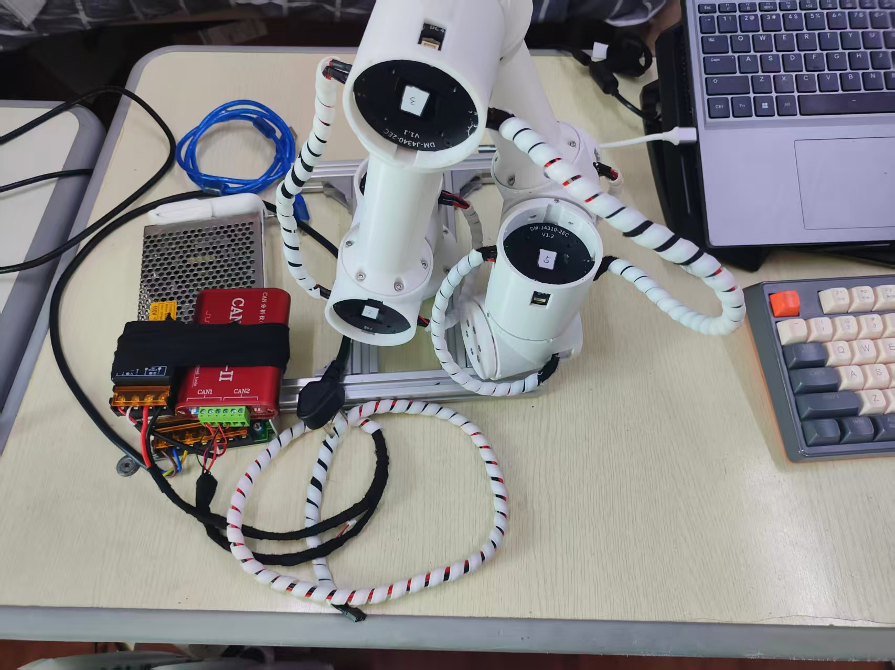
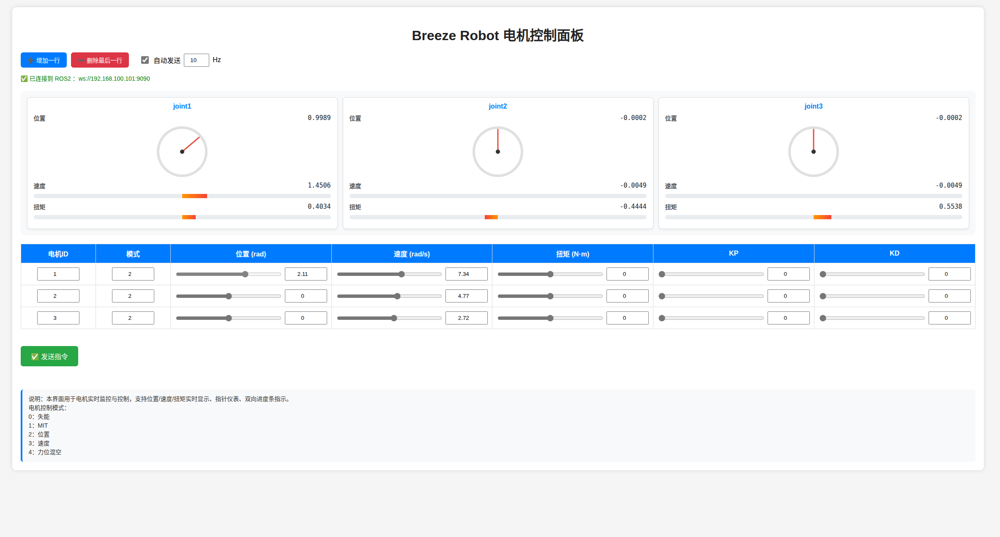
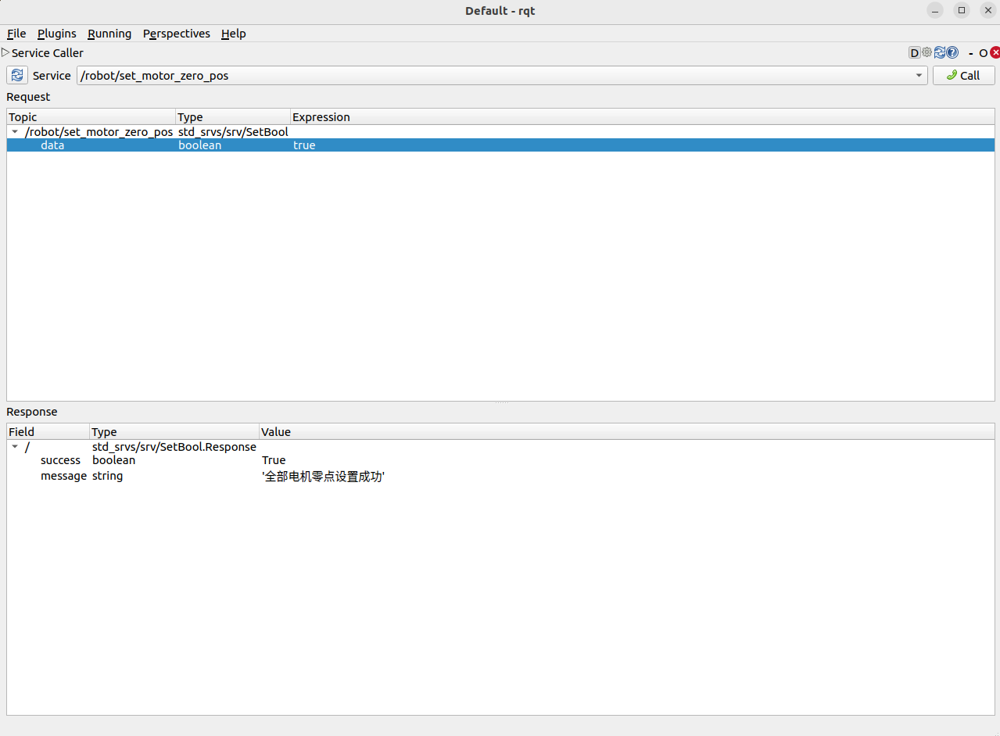
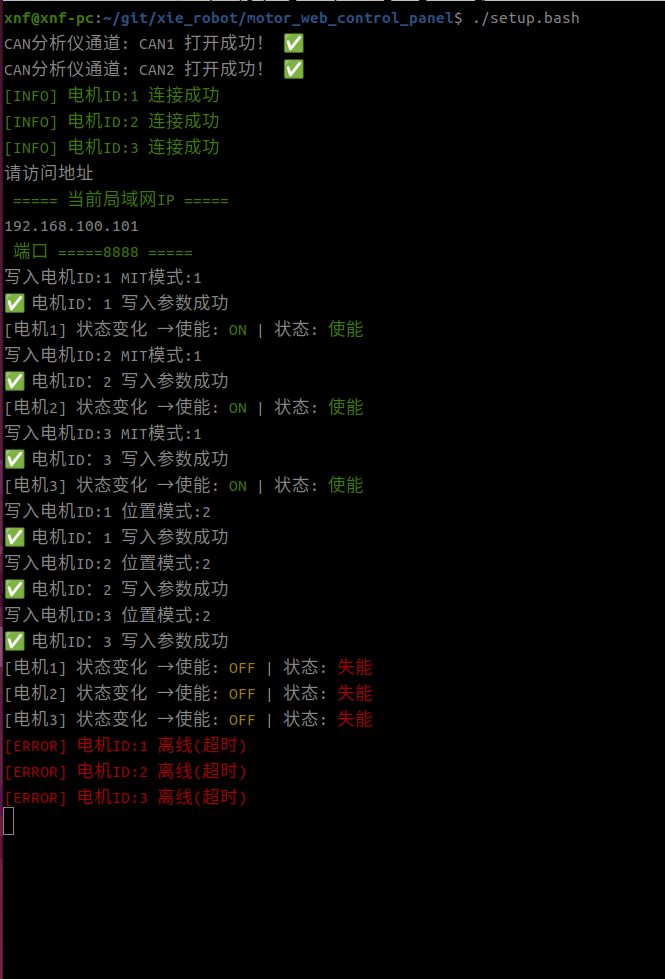
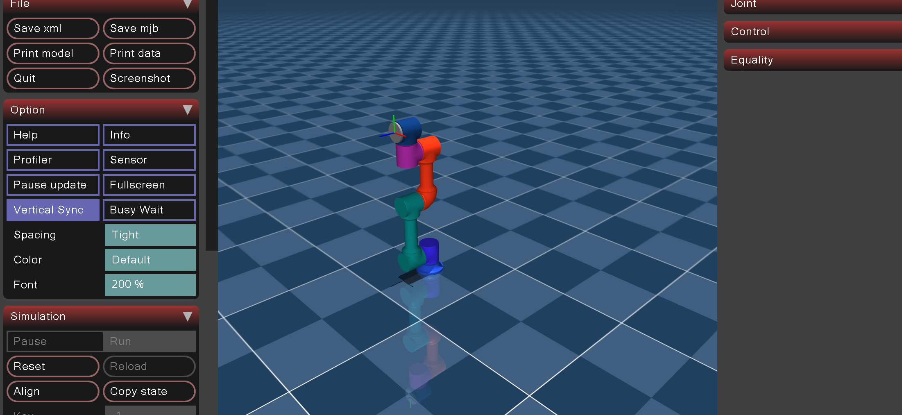

# Breeze Robot
## 项目简介

本项目是Breeze Robot中开源电机控制部分

基于C++开发，可直接作为机械臂底层开发方案

- 支持达妙电机使能、失能、模式切换，具备零点保存等功能
- 配套Web控制程序，多电机、多模式切换调试丝滑
- 支持多电机、多CAN路扩展
- 支持电机连接反馈、掉线状态反馈，离线快速重连
- 支持ROS话题控制四种模式，适配机械臂整体控制
- 支持重力补偿mujoco可视化，便于直观观察电机及机械臂运行状态
- 支持moveit2控制

## 硬件结构
本项目机械臂硬件结构及 URDF  **基于开源项目 [mockway_robotics](https://github.com/Jelatine/mockway_robotics)** 进行二次开发与适配。


## 硬件设备
电机：3x达妙4340 ，3x达妙4310

USB-CAN:创芯科技can分析仪linux版





## 环境依赖
- Ubuntu 22.04  (X64)
- ROS 2 Humble
- C++17


## 电机控制
电机控制界面



通过服务进行零点设置


硬件设备启动
```bash
cd motor_web_control_panel/
./setup.bash
```
终端效果



浏览器访问
```bash 
启动设备ip:8888
```


## mujoco可视化



```bash
ros2 run arm_mujoco_sim arm_sim_display_node 
```

## moveit控制
```bash
ros2 launch moveit_relay moveit_relay_launch.py
```
